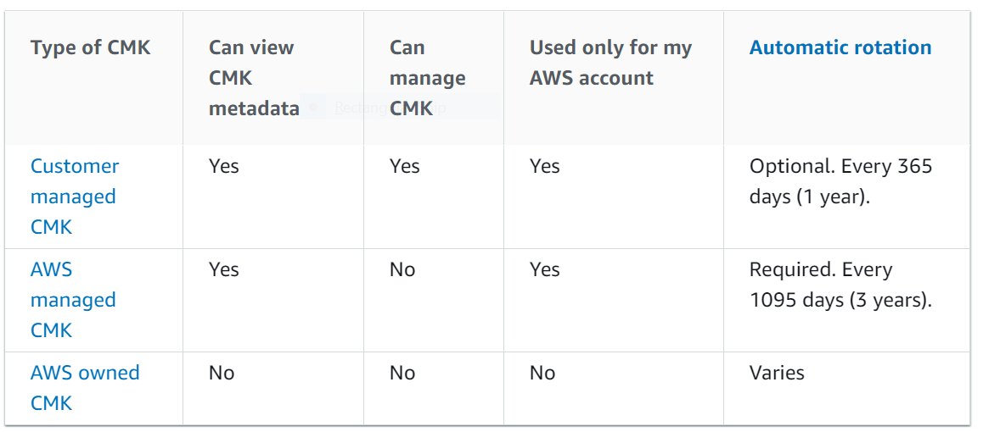
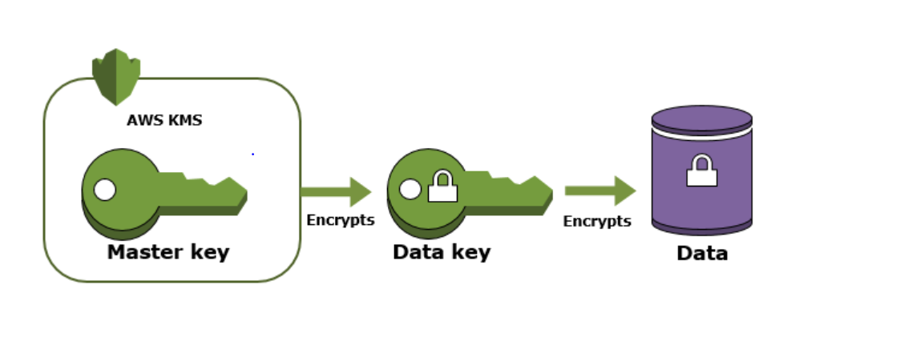

# AWS KMS Keys

1. Region-based service
1. AWS Managed Keys
1. AWS Owned Managed Keys
1. AWS Customer Managed Keys:
      * Key policies - __primary way__ to control access to CMKs. 
          * Default key policy:
              * When using AWS SDK or AWS CLI policy can be definied programatically. If not definied __default__ gives the AWS account (root user) that owns the CMK full access to the CMK and enables IAM policies in the account to allow access to the CMK.
               * When using AWS Console it is possible to choose the IAM users, IAM roles, and AWS accounts that are given access to the CMK.
      * Customer managed CMKs are CMKs in your AWS account that you create, own, and manage. You have full control over these CMKs, including establishing and maintaining their key policies, IAM policies, and grants, enabling and disabling them, rotating their cryptographic material, adding tags, creating aliases that refer to the CMK, and scheduling the CMKs for deletion.
      * Symmetric
      * Asymmeric
      * By __default__ AWS creates __key material__ for CMK, key material can be imported
      * __Asymmetric__ & __keys with imported material__ __CANNOT__ be rotated
      * Rotate keys manually if you want to control __frequency__ of key rotation
      * Automatic key rotation gives following: no need to update key id, arn, alias in applications. key ID, key ARN, region, policies, and permissions, do not change when the key is rotated. However, automatic key rotation has no effect on the data that the CMK protects. It does not rotate the data keys that the CMK generated or re-encrypt any data protected by the CMK, and it will not mitigate the effect of a compromised data key.
      
      * _Envelope encryption_ is the practice of encrypting plaintext data with a data key, and then encrypting the data key under another key. 
       

