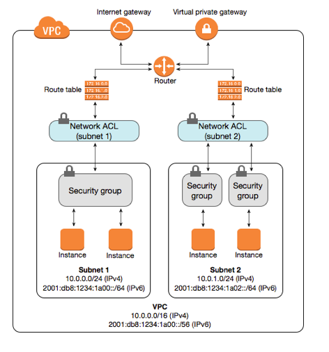

# Difference Security Group & NACL

### Scopes
* Security Group is a **firewall** on **EC2 Instances**
* NACL is a **firewall** on **subnets**

### Stateful vs. stateless

* Security Group is **stateful** - affects **inbound & outbound** traffic
* NACL is **stateless** - can be set on **inbound OR outbound OR both**

### Occurence
* **multiple** security groups can be assigned to EC2 instances
* **ONE** NACL can be assigned to subnet

### Processing order
* NACL evaluate evaluated starting with the lowest **numbered rule**
* Security group evalutes all the rules before allowing traffic

### Defense order
* SG - **1st** defense order
* NACL - **2nd** defense order

